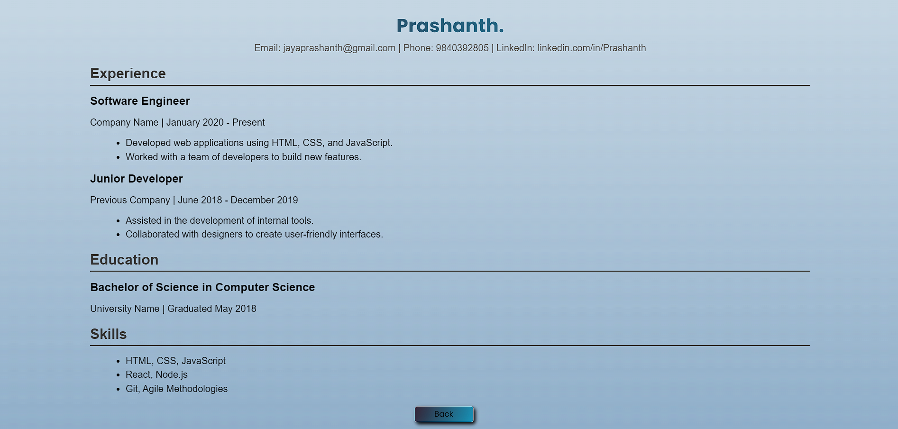

# Prashanth's Resume

Welcome to my GitHub repository for my resume developed using CSS and HTML. Below you will find the necessary information about the project and how to view it.

## Preview




## Description

This project showcases my resume, which has been created using HTML and CSS. It highlights my skills, experience, education, and projects in a clean and professional format.

## Table of Contents

- [Getting Started](#getting-started)
- [Features](#features)
- [Technologies Used](#technologies-used)
- [Usage](#usage)
- [Contributing](#contributing)
- [Contact](#contact)

## Getting Started

To view my resume, simply open the `index.html` file in your web browser.

1. Clone the repository:
   ```bash
   git clone https://github.com/your-github/your-resume-repo.git
   ```
2. Navigate to the project directory:
   ```bash
   cd your-resume-repo
   ```
3. Open `index.html` in your preferred web browser.

## Features

- **Responsive Design:** The resume is designed to be responsive and looks great on all devices.
- **Clean Layout:** A clean and modern layout that is easy to read and navigate.
- **Interactive Elements:** Includes interactive elements such as links and buttons.

## Technologies Used

- **HTML5**
- **CSS3**

## Usage

Feel free to use this template for your own resume. You can customize the HTML and CSS files to suit your needs.

## Contributing

If you would like to contribute to this project, please fork the repository and create a pull request with your changes.

1. Fork the repository.
2. Create a new branch:
   ```bash
   git checkout -b feature/your-feature
   ```
3. Commit your changes:
   ```bash
   git commit -m 'Add some feature'
   ```
4. Push to the branch:
   ```bash
   git push origin feature/your-feature
   ```
5. Open a pull request.

## Contact

If you have any questions or would like to get in touch, feel free to contact me at [jayaprashanth@gmail.com].

